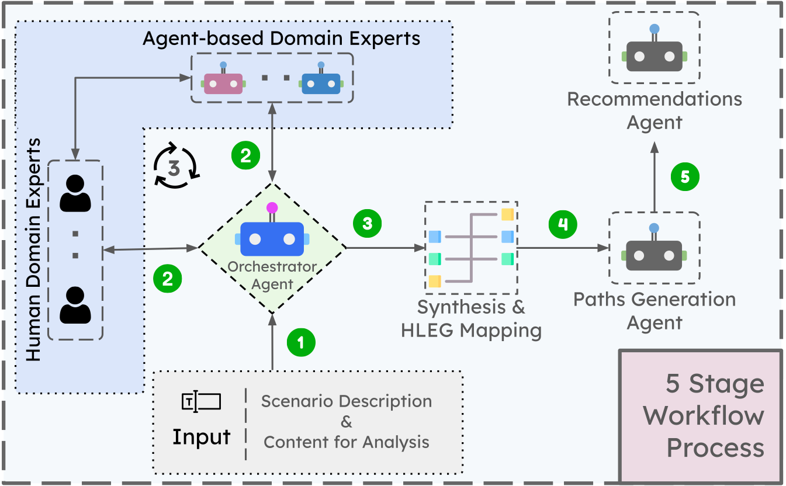
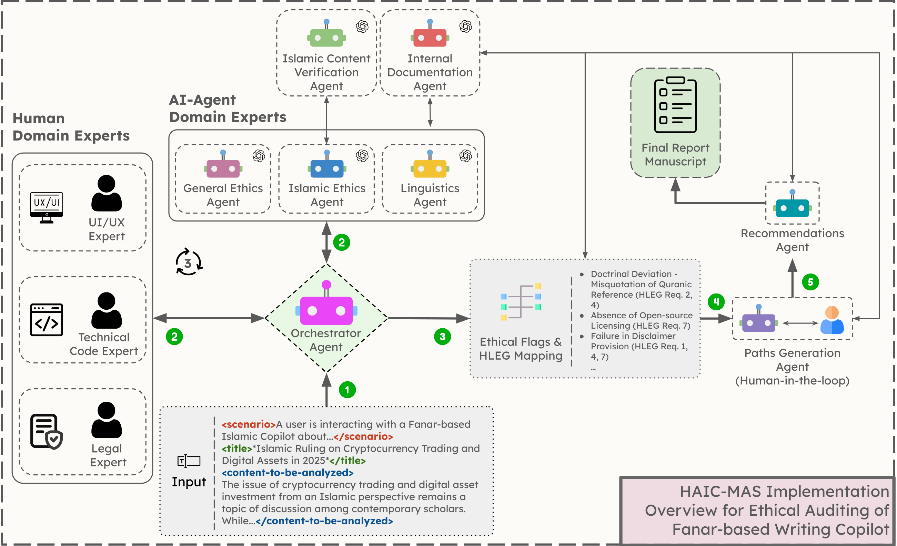

# Human-AI Collaborative Ethical Auditing for AI Applications using Multi-Agent LLM Systems

A framework for applying Human-AI Collaboration and Multi-Agent Systems to ethical auditing of AI applications, demonstrated through Z-Inspection methodology principles.

## 🎯 Overview

We propose a **HAIC-MAS** (Human-AI Collaborative Multi-Agent System) framework that applies Human-AI collaboration principles to ethical auditing processes. Rather than replacing human experts with AI agents, our approach facilitates collaboration between human domain experts and specialized AI agents within the auditing process.

### Approach

Our framework applies Multi-Agent Systems to implement structured ethical auditing based on **Z-Inspection methodology principles** - a multidisciplinary process for evaluating AI system trustworthiness. This addresses some practical limitations in resource-intensive assessments:

- **Traditional human-led audits**: Resource-intensive, limited expert availability, scalability constraints
- **Fully automated approaches**: Lack contextual understanding, cultural sensitivity, and human oversight
- **Our HAIC approach**: Facilitates collaboration between AI analysis and human expertise

## 🚀 Framework Features

### Core Capabilities

- **Human-AI Collaborative Assessment**: Coordination between human experts and AI agents
- **Multi-Agent Architecture**: Specialized agents for different evaluation domains
- **Z-Inspection Inspired**: Three-phase process structure (Setup, Assess, Resolve)
- **Dual Ethics Framework**: General AI ethics + domain-specific ethical guidelines
- **Cultural Context Support**: Evaluation for culturally sensitive AI applications
- **Modular Design**: Adaptable to different domains and use cases

### Technical Implementation

- **OpenAI Agents SDK**: Agent coordination and communication
- **o3 Reasoning Models**: Ethical analysis capabilities
- **Comprehensive Logging**: Transparency and auditability
- **Human-in-the-Loop**: Human oversight throughout the process

## 📊 Framework Workflow

Our HAIC-MAS Framework implements a five-stage process:

1. **Input Processing**: Context definition and analysis task distribution
2. **Collaborative Multi-Expert Analysis**: Human experts + AI agents working together
3. **Synthesis and Mapping**: Findings consolidation against ethical frameworks
4. **Collaborative Path Generation**: Human-guided remediation strategy development
5. **Human-AI Decision Integration**: Final recommendations with human oversight

### Workflow Diagram



## 🕌 Use Case: Fanar-Based Islamic Writing Copilot Assessment

This repository demonstrates the framework through an ethical audit of an Islamic Writing Copilot - representing AI applications where alignment with authoritative knowledge systems is important.


### Why This Use Case?

Islamic AI applications present complex ethical challenges:

- **Doctrinal Accuracy**: Maintaining theological precision
- **Cultural Sensitivity**: Navigating diverse jurisprudential traditions
- **Religious Authority**: Avoiding inappropriate claims to religious guidance
- **Source Verification**: Ensuring authentic Quranic and Hadith references

These challenges are similar to those in legal, medical, and scientific writing systems where accuracy is critical.

## 🤖 Multi-Agent System Implementation

Our use case implementation employs a multi-agent architecture for Islamic content auditing:

### AI Agents

| Agent                                  | Role                               | Primary Focus                                                           |
| -------------------------------------- | ---------------------------------- | ----------------------------------------------------------------------- |
| **Ethics Agent**                       | General AI ethics evaluation       | HLEG guidelines assessment, trustworthy AI principles                   |
| **Islamic Ethics Agent**               | Islamic-specific ethics assessment | Theological accuracy, jurisprudential compliance, cultural sensitivity  |
| **Linguistic Expert Agent**            | Language and tone analysis         | Clarity, appropriateness, accessibility, communication effectiveness    |
| **Path Generation Agent**              | Remediation strategy development   | Actionable solutions, implementation guidance, complexity assessment    |
| **Recommendation Agent**               | Implementation planning            | Detailed execution plans, resource requirements, maintenance strategies |
| **Internal Docs Agent**                | RAG-based contextual support       | System documentation, contextual information retrieval                  |
| **Islamic Content Verification Agent** | Religious content validation       | Quranic verses, Hadith authentication, source verification              |

### Human Expert Integration

| Expert Domain        | Contribution                                | Interface                                  |
| -------------------- | ------------------------------------------- | ------------------------------------------ |
| **Legal Expert**     | Compliance assessment, regulatory alignment | File-based review, structured CLI          |
| **Technical Expert** | Code quality, system architecture           | GitHub repository analysis                 |
| **UI/UX Expert**     | User experience, accessibility              | Interface evaluation, usability assessment |

### Use Case Implementation Diagram



### Collaboration Patterns

The framework demonstrates **Human-AI Collaboration Level 3** patterns:

- **Human Leadership**: Domain experts guide analysis and make final decisions
- **AI Support**: Systematic analysis, consistency checking, scalability
- **Iterative Refinement**: Human-in-the-loop path generation and validation
- **Flexible Distribution**: AI agents support when human experts are unavailable

## 🏗️ Project Structure

```
Z-Inspection-MAS/
├── main.py                          # Framework entry point
├── agents_impl/                     # Core agent implementations
│   ├── ethical_agent.py            # General ethics evaluation (HLEG)
│   ├── islamic_ethical_agent.py    # Islamic-specific ethics assessment
│   ├── islamic_content_verification_agent.py  # Religious content validation
│   ├── linguistic_expert_agent.py  # Language and tone analysis
│   ├── path_generation_agent.py    # Remediation strategy generation
│   ├── recommendation_agent.py     # Implementation guidance
│   └── internal_docs_agent.py      # RAG-based contextual support
├── human_agents_impl/               # Human expert interfaces
│   ├── legal_human.py              # Legal compliance expert
│   ├── technical_human.py          # Technical assessment expert
│   ├── ui_ux_human.py              # User experience expert
│   └── orchestrator_human_agents.py # Human-AI coordination interface
├── configs/                         # Framework configuration
│   ├── general_ethics.py           # HLEG-based evaluation criteria
│   ├── islamic_ethics.py           # Islamic ethical guidelines
│   └── input_format_config.py      # Input processing configuration
├── prompts/                         # Agent prompt templates
├── schemas/                         # Structured output schemas
├── tools_defs/                      # Agent tools and capabilities
├── utils/                           # Helper utilities and formatters
├── data/                            # Assessment data and scenarios
├── z_inspection_logs/               # Comprehensive audit trails
├── human_feedback/                  # Human expert contributions
├── docs/                            # Documentation and setup guides
└── requirements.txt                 # Dependencies
```

## 🚀 Quick Start

### Prerequisites

- Python 3.8+
- OpenAI API access
- Git

### Installation

1. **Clone the repository:**

```bash
git clone https://github.com/rafaayyyy/Z-Inspection-MAS.git
cd Z-Inspection-MAS
```

2. **Set up virtual environment:**

```bash
python -m venv .zenv
source .zenv/bin/activate  # On Windows: .zenv\Scripts\activate
```

3. **Install dependencies:**

```bash
pip install -r requirements.txt
```

4. **Configure environment:**

```bash
cp .env.example .env
# Edit .env with your OpenAI and Tavily API key and configuration
```

### Basic Usage

1. **Define your assessment scenario and content** in `data/toassess.py`
2. **Configure ethical frameworks** in `configs/`
3. **Run the assessment:**

```bash
python main.py
```

4. **Review results** in `z_inspection_logs/` directory

## 🔧 Configuration

### Ethical Frameworks

- **`configs/general_ethics.py`**: EU HLEG guidelines for Trustworthy AI
- **`configs/islamic_ethics.py`**: Islamic ethical principles and values
- **Custom frameworks**: Easily adaptable for domain-specific requirements

### Agent Configuration

- **Domain Experts**: Configure human vs. AI expert distribution
- **Collaboration Patterns**: Adjust human-AI interaction levels
- **Assessment Criteria**: Customize evaluation frameworks
- **Output Formats**: Structured reporting and logging

## 📈 Contributions

### 1. HAIC Framework Application

- Application of Human-AI Collaboration principles to ethical auditing
- Multi-Agent System implementation for collaborative assessment
- Maintains human oversight while utilizing AI capabilities

### 2. Collaborative Intelligence Implementation

- Demonstrates Human-AI collaboration in ethical assessment
- Multi-perspective evaluation through agent specialization
- Human-in-the-loop remediation strategy development

### 3. Cultural Context Integration

- Dual-framework approach combining general and domain-specific ethics
- Practical demonstration with Islamic AI applications
- Adaptable structure for diverse cultural and regulatory contexts

## 📜 License

This project is licensed under the **MIT License** - see the [LICENSE](LICENSE) file for details.

The MIT License allows for:

- Commercial and private use
- Modification and distribution
- Patent use
- No liability or warranty obligations

## 📚 Publications & Citations

## 🔗 Related Resources

- [Z-Inspection Methodology](https://z-inspection.org/) - Original Z-Inspection framework and methodology
- [EU HLEG Ethics Guidelines](https://digital-strategy.ec.europa.eu/en/library/ethics-guidelines-trustworthy-ai)
- [OpenAI Agents SDK](https://platform.openai.com/docs/assistants/overview)
- [Collective Intelligence Research](https://unanimous.ai/)

## 📞 Contact & Support

- **Issues**: Please use GitHub Issues for bug reports and feature requests
- **Discussions**: Join our GitHub Discussions for questions and ideas

## 🙏 Acknowledgments

This work applies principles from:

- Z-Inspection methodology developed by the Z-Inspection community
- Human-AI Collaboration research by Louis Rosenberg and Unanimous AI
- Islamic AI ethics scholarship by various Islamic scholars and researchers
- European Commission's HLEG guidelines for Trustworthy AI

**Note**: This project is an independent application of Z-Inspection principles and is not affiliated with or endorsed by the original Z-Inspection development team.

---

**⭐ Star this repository if you find it useful for your ethical AI auditing work!**
